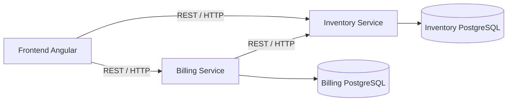

# Korp — Gestão de Estoque e Notas Fiscais

Desafio técnico para cadastro de produtos e emissão de notas fiscais, desenvolvido com Angular, Go com Gin, PostgreSQL e Docker Compose.

O backend é composto por dois microsserviços:

- **Inventory Service:** mantém produtos, saldos e o histórico idempotente de baixas.
- **Billing Service:** mantém notas fiscais, prepara a impressão e coordena a baixa no Inventory Service.

## Funcionalidades

### Funcionalidades obrigatórias

- Cadastro, consulta, edição e exclusão de produtos.
- Listagem de produtos com busca, filtro por estoque, ordenação e paginação.
- Criação e consulta de notas com um ou mais produtos e quantidades.
- Numeração sequencial, exibida com quatro dígitos, por exemplo `0001`.
- Estados **Aberta** e **Fechada**.
- Preparação para impressão e fechamento da nota.
- Validação e baixa atômica do estoque ao finalizar.
- Feedback de carregamento e bloqueio de ações durante requisições.
- Mensagens para indisponibilidade, estoque insuficiente e outras falhas da interface.
- Repetição manual de uma finalização interrompida, sem fechar a nota antes da baixa.

### Funcionalidades opcionais

| Requisito    | Estado           | Implementação                                                                                                                         |
| ------------ | ---------------- | ------------------------------------------------------------------------------------------------------------------------------------- |
| Concorrência | Implementado     | Transações e `FOR UPDATE` impedem que notas concorrentes consumam as mesmas últimas unidades; códigos de produto têm restrição única. |
| Idempotência | Implementado     | O número da nota identifica a baixa. Repetir a mesma baixa não reduz o estoque novamente; conteúdo diferente é rejeitado.             |
| IA           | Não implementado | O projeto não possui funcionalidade de inteligência artificial.                                                                       |

## Detalhamento técnico

### Angular: ciclo de vida e estado

O único hook de ciclo de vida usado explicitamente é o `ngOnInit`, por meio da interface `OnInit`:

- `ProductList`: inicia o carregamento da lista de produtos.
- `InvoiceList`: inicia o carregamento das notas fiscais.
- `InvoiceDetail`: lê o número da rota e carrega a nota correspondente.

Não há implementações de `OnChanges`, `AfterViewInit` ou `OnDestroy`. Nos pontos que precisam acompanhar a destruição do componente, o projeto usa `DestroyRef` com `takeUntilDestroyed`, evitando um `ngOnDestroy` manual. O estado local das telas é mantido com Angular Signals, usando `signal` e `computed`.

### Uso de RxJS

O `HttpClient` retorna Observables para todas as chamadas às APIs. Os componentes fazem `subscribe` com callbacks `next` e `error` para atualizar estados e mensagens. Também são usados:

- `valueChanges` dos Reactive Forms para reagir a alterações e limpar erros de validação.
- `takeUntilDestroyed` para encerrar assinaturas quando o componente é destruído.
- `finalize` no detalhamento da nota para restaurar os estados de “verificando estoque” e “finalizando” tanto em sucesso quanto em falha.
- `BreakpointObserver`, do Angular CDK, para adaptar a navegação a telas de até 900 px.

Não há store global ou NgRx; o gerenciamento permanece local aos componentes e serviços HTTP.

### Stack e bibliotecas

| Tecnologia              | Finalidade no projeto                                          |
| ----------------------- | -------------------------------------------------------------- |
| Angular 21 / TypeScript | Aplicação web com componentes standalone                       |
| Angular Router          | Rotas e carregamento sob demanda                               |
| Angular Reactive Forms  | Formulários tipados, arrays de itens e validações              |
| Angular Material / CDK  | Componentes visuais, ordenação e navegação responsiva          |
| RxJS                    | Observables HTTP, reação a formulários e ciclo das assinaturas |
| Go 1.25 / Gin Framework | APIs REST dos microsserviços                                   |
| pgx/v5                  | Acesso direto ao PostgreSQL, pools e transações                |
| PostgreSQL 17           | Persistência independente de estoque e faturamento             |
| Docker / Docker Compose | Build, rede, serviços, bancos e volumes                        |
| Go `testing`            | Testes dos serviços                                            |
| Vitest + jsdom          | Testes unitários do frontend em ambiente DOM                   |
| Playwright              | Teste ponta a ponta contra a pilha completa                    |

Os componentes visuais são fornecidos pelo **Angular Material**, com suporte do **Angular CDK**, e recebem estilos personalizados em CSS. Não foi utilizada outra biblioteca visual.

### Go: framework e dependências

Os dois serviços usam **Gin** como framework HTTP para rotas, parâmetros, leitura de JSON, middleware e respostas. O PostgreSQL é acessado diretamente com **pgx/v5** e seu pool de conexões, sem ORM. A biblioteca padrão cobre o cliente HTTP entre serviços, contextos, templates de impressão, logging e encerramento controlado.

Cada microsserviço é um módulo Go independente, com seus próprios `go.mod` e `go.sum`. O Go Modules fixa e verifica versões; os Dockerfiles executam `go mod download` durante o build. Alterações de dependências podem ser normalizadas com `go mod tidy` em cada serviço usando os comandos abaixo.

```bash
docker compose exec inventory-service go mod tidy
docker compose exec billing-service go mod tidy
```

### Erros e exceções no backend

Os handlers verificam os valores `error` retornados e os convertem em códigos HTTP:

- `400 Bad Request` para corpo ou dados inválidos.
- `404 Not Found` para recursos inexistentes.
- `409 Conflict` para duplicidade, estado incompatível ou conflito de idempotência.
- `422 Unprocessable Entity` para produto ausente ou estoque insuficiente.
- `502 Bad Gateway` quando o Billing não consegue comunicar-se corretamente com o Inventory.
- `500 Internal Server Error` para falhas internas inesperadas.

`errors.Is` identifica casos como `pgx.ErrNoRows`, e `errors.As` inspeciona erros PostgreSQL, como a violação de unicidade `23505`. Operações compostas usam transações com `Rollback` adiado e `Commit` apenas após sucesso. O cliente HTTP entre serviços possui timeout de cinco segundos. O middleware `gin.Recovery()` impede que um panic derrube o processo, enquanto erros fatais de inicialização são propagados, registrados em JSON com `log/slog` e encerram o serviço. As APIs não expõem detalhes de banco ou stack traces ao cliente.

### C# e LINQ

C# não é utilizado nesta implementação, LINQ não se aplica ao projeto.

## Arquitetura



O navegador acessa diretamente as duas APIs REST. Cada serviço possui seu PostgreSQL e não acessa o banco do outro. Para validar produtos e estoque e efetuar a baixa, o Billing chama o Inventory por HTTP.

Estoque e faturamento foram separados por responsabilidade de negócio. Cada serviço é dono de seus dados e integra por HTTP, preservando a independência dos bancos. Internamente, são usados pacotes simples orientados às funcionalidades, sem ORM, repositórios genéricos ou camadas arquiteturais adicionais.

## Estrutura do projeto

```text
.
├── backend/
│   ├── inventory-service/
│   │   ├── cmd/api/
│   │   └── internal/{database,health,product}/
│   └── billing-service/
│       ├── cmd/api/
│       └── internal/{database,health,invoice}/
├── frontend/
│   ├── e2e/
│   └── src/app/{home,invoices,products}/
├── scripts/
├── docker-compose.yml
├── docker-compose.e2e.yml
├── AGENTS.md
├── CONTEXT.md
└── README.md
```

- `frontend/`: workspace Angular CLI, telas, rotas e clientes HTTP.
- `backend/inventory-service/`: módulo Go de produtos e estoque.
- `backend/billing-service/`: módulo Go de notas fiscais.
- `cmd/api/`: entrada, servidor HTTP, CORS e encerramento controlado.
- `internal/database/`: conexão PostgreSQL e migrations.
- `internal/health/`: endpoint de saúde da aplicação e do banco.
- `internal/product/` e `internal/invoice/`: handlers e regras das funcionalidades.
- `frontend/e2e/` e `scripts/`: cenário Playwright e seu executor isolado.

No Angular, `home/`, `products/` e `invoices/` agrupam componentes standalone. Cada funcionalidade possui modelos e cliente de API, enquanto `app.routes.ts` carrega as telas sob demanda.

Nos serviços Go, `cmd/api/` monta o servidor; `internal/database/` conecta e migra o banco; `internal/health/` verifica a disponibilidade; e `internal/product/` ou `internal/invoice/` concentra os handlers e regras.

## Execução

### Requisitos

- Git
- Docker
- Docker Compose (comando `docker compose`)

Não é necessário instalar Go, Node.js, npm, Angular CLI ou PostgreSQL no host para executar ou testar o projeto.

### Ambiente

O projeto funciona após o clone sem um `.env`, pois o Compose possui padrões de desenvolvimento. Para personalizá-los:

```bash
cp .env.example .env
```

| Variável                 | Uso                                 | Padrão                          |
| ------------------------ | ----------------------------------- | ------------------------------- |
| `INVENTORY_DB_USER`      | Usuário do banco de estoque         | `inventory`                     |
| `INVENTORY_DB_PASSWORD`  | Senha local do banco de estoque     | `inventory_dev_password`        |
| `INVENTORY_DB_NAME`      | Nome do banco de estoque            | `inventory`                     |
| `BILLING_DB_USER`        | Usuário do banco de faturamento     | `billing`                       |
| `BILLING_DB_PASSWORD`    | Senha local do banco de faturamento | `billing_dev_password`          |
| `BILLING_DB_NAME`        | Nome do banco de faturamento        | `billing`                       |
| `INVENTORY_SERVICE_PORT` | Porta da API no host                | `8081`                          |
| `BILLING_SERVICE_PORT`   | Porta da API no host                | `8082`                          |
| `INVENTORY_SERVICE_URL`  | Endereço usado pelo Billing         | `http://inventory-service:8081` |
| `CORS_ALLOWED_ORIGIN`    | Origem aceita pelas APIs            | `http://localhost:4200`         |

Os valores do exemplo são credenciais apenas para desenvolvimento local.

### Iniciar e acessar

```bash
docker compose up --build
```

Em segundo plano:

```bash
docker compose up --build -d
```

Isso inicia o frontend, duas APIs e dois bancos. As APIs aguardam seus bancos ficarem saudáveis.

O Docker Compose foi escolhido para tornar a execução reproduzível sem exigir os runtimes, ferramentas e bancos instalados no host.

| Serviço              | URL / porta padrão             | Finalidade                         |
| -------------------- | ------------------------------ | ---------------------------------- |
| Frontend             | <http://localhost:4200>        | Interface                          |
| Inventory API        | <http://localhost:8081>        | Produtos e estoque                 |
| Inventory health     | <http://localhost:8081/health> | Saúde da API e banco               |
| Billing API          | <http://localhost:8082>        | Notas e impressão                  |
| Billing health       | <http://localhost:8082/health> | Saúde da API e banco               |
| Inventory PostgreSQL | `localhost:5433`               | Banco exposto para desenvolvimento |
| Billing PostgreSQL   | `localhost:5434`               | Banco exposto para desenvolvimento |

Com API e banco disponíveis, o health retorna HTTP `200`:

```json
{ "database": "ok", "service": "ok", "status": "ok" }
```

Se apenas o banco estiver indisponível, a API responde HTTP `503` com estado `degraded`.

### Parar e reconstruir

```bash
docker compose down
```

Esse comando remove contêineres e rede, preservando os volumes nomeados. Para apagar também bancos, caches e demais volumes:

```bash
docker compose down -v
```

> **Atenção:** esse comando remove os volumes PostgreSQL e exclui permanentemente os dados de desenvolvimento dos dois bancos.

Use `docker compose up --build` após alterações que precisem ser incorporadas às imagens. Para apenas reconstruir as imagens sem iniciar a aplicação, use `docker compose build`.

## Fluxo principal

1. Em **Produtos**, cadastre um item com código `AAA00`, descrição e estoque.
2. Em **Notas fiscais**, crie uma nota com um ou mais produtos e quantidades.
3. A nota recebe número sequencial e fica **Aberta**.
4. Abra seus detalhes e selecione **Imprimir**.
5. O estoque é validado e o documento HTML é enviado para impressão.
6. A finalização solicita ao Inventory a baixa atômica das linhas.
7. Após a confirmação, a nota fica **Fechada** e os saldos são reduzidos.

Uma nota aberta não reserva estoque; a disponibilidade é verificada antes da impressão e no consumo.

### Processamento da nota

```text
Angular → Billing Service → Inventory Service → Inventory PostgreSQL
               ↓                    ↓
       Billing PostgreSQL ← confirmação da baixa
               ↓
            Angular
```

O Angular pede a preparação ao Billing. Este consulta o Inventory e, havendo saldo, registra a preparação e devolve o HTML. Na finalização, o Billing persiste o estado pendente, solicita a baixa idempotente e só então fecha a nota. Uma falha mantém a nota aberta para nova tentativa.

## Demonstração de falha entre microsserviços

Com a aplicação ativa, cadastre um produto com estoque e uma nota aberta. Então:

```bash
docker compose stop inventory-service
```

1. Abra a nota e tente **Imprimir**.
2. Observe a mensagem de falha ao verificar o estoque.
3. Confirme que a nota continua **Aberta**.
4. Reinicie o serviço:

```bash
docker compose start inventory-service
```

5. Aguarde <http://localhost:8081/health> retornar HTTP `200`.
6. Selecione **Imprimir** novamente.
7. Confirme a nota **Fechada** e o saldo reduzido.

A recuperação exige a tentativa manual após o Inventory voltar. A baixa idempotente também protege a repetição quando a falha ocorre depois do consumo, mas antes de persistir o fechamento.

## Bancos e migrations

```text
Inventory Service → Inventory Database
                    ├── products
                    ├── stock_consumptions
                    └── schema_migrations

Billing Service   → Billing Database
                    ├── invoices
                    ├── invoice_lines
                    └── schema_migrations
```

Os dados ficam em `inventory-db-data` e `billing-db-data`. Reinícios e `docker compose down` os preservam; `docker compose down -v` remove os volumes.

As migrations ficam em `internal/database/migrations/` de cada serviço. Arquivos `*.up.sql` são incorporados ao binário, ordenados pelo nome e executados automaticamente em transações na inicialização. `schema_migrations` impede reaplicações. Para uma mudança, adicione a próxima migration numerada, como `005_descricao.up.sql`. Arquivos `*.down.sql` registram reversões, mas o executor atual não os aplica automaticamente.

## APIs REST

Os endpoints `/stock` são contratos entre os microsserviços, embora expostos na porta da API.

### Inventory Service

| Método   | Endpoint          | Finalidade                                 |
| -------- | ----------------- | ------------------------------------------ |
| `GET`    | `/health`         | Verificar serviço e banco                  |
| `POST`   | `/products`       | Cadastrar produto                          |
| `GET`    | `/products`       | Listar produtos                            |
| `GET`    | `/products/:id`   | Consultar produto                          |
| `PUT`    | `/products/:id`   | Atualizar produto                          |
| `DELETE` | `/products/:id`   | Excluir produto                            |
| `POST`   | `/stock/validate` | Validar existência e saldo                 |
| `POST`   | `/stock/consume`  | Consumir linhas atômica e idempotentemente |

### Billing Service

| Método | Endpoint                          | Finalidade                   |
| ------ | --------------------------------- | ---------------------------- |
| `GET`  | `/health`                         | Verificar serviço e banco    |
| `POST` | `/invoices`                       | Criar nota aberta            |
| `GET`  | `/invoices`                       | Listar notas                 |
| `GET`  | `/invoices/:number`               | Consultar nota e itens       |
| `POST` | `/invoices/:number/prepare-print` | Validar estoque e gerar HTML |
| `POST` | `/invoices/:number/close`         | Baixar estoque e fechar nota |

### Erros

Erros gerais retornam o campo `error` com uma mensagem interna em inglês:

```json
{ "error": "inventory unavailable" }
```

Falhas de estoque retornam `problems`, com motivos como `product_not_found` e `insufficient_stock`, produto e quantidades. A interface converte as respostas em mensagens para o usuário em português brasileiro. O mecanismo interno de tratamento está descrito em “Erros e exceções no backend”.

## Testes e verificações

Os comandos abaixo pressupõem a pilha iniciada em segundo plano.

### Backend

```bash
docker compose exec inventory-service go test ./...
docker compose exec billing-service go test ./...
```

### Frontend

```bash
docker compose exec frontend npm test -- --watch=false
docker compose exec frontend npm run build
```

### Ponta a ponta

```bash
./scripts/test-e2e.sh
```

O script cria uma pilha Compose isolada e bancos descartáveis. Ele cadastra produto e nota pela interface, fecha a nota e confirma a baixa; depois remove apenas sua pilha. O log fica em `frontend/test-results/e2e.log`; em falhas, resultados e trace também são copiados para `frontend/test-results/`.

### Resultado da verificação

| Verificação                                              | Resultado                |
| -------------------------------------------------------- | ------------------------ |
| Build e inicialização com `docker compose up --build -d` | Aprovado                 |
| Health checks e portas documentadas                      | Aprovado                 |
| Testes do Inventory Service                              | Aprovado                 |
| Testes do Billing Service                                | Aprovado                 |
| Build de produção do Angular                             | Aprovado                 |
| Teste E2E Playwright                                     | Aprovado: 1 de 1 cenário |
| Testes unitários do frontend                             | 52 de 53 aprovados       |
| Indisponibilidade do Inventory e tentativa posterior     | Aprovado                 |

O teste frontend `formats dates for Brazil and shows empty-filter state`, em `product-list.spec.ts`, espera horários fixos de Brasília, mas o contêiner formatou as datas em UTC. Por isso, a suíte unitária frontend ainda não está totalmente verde em Docker.

Além dos comandos automatizados, a validação manual relevante inclui os endpoints `/health`, o fluxo principal e o cenário de indisponibilidade.

## Comandos Docker úteis

| Ação                      | Comando                                    |
| ------------------------- | ------------------------------------------ |
| Iniciar e reconstruir     | `docker compose up --build`                |
| Iniciar em segundo plano  | `docker compose up --build -d`             |
| Reconstruir sem iniciar   | `docker compose build`                     |
| Ver o estado dos serviços | `docker compose ps`                        |
| Acompanhar todos os logs  | `docker compose logs -f`                   |
| Ver logs do Inventory     | `docker compose logs inventory-service`    |
| Reiniciar o Inventory     | `docker compose restart inventory-service` |
| Parar preservando dados   | `docker compose down`                      |
| Parar e apagar volumes    | `docker compose down -v`                   |
